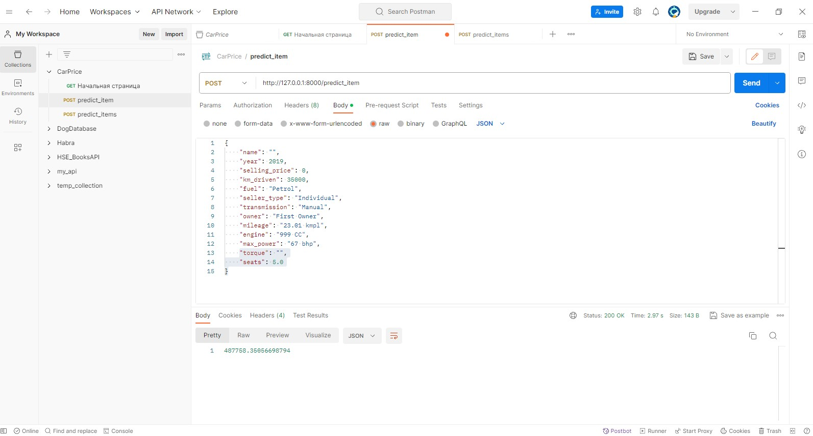
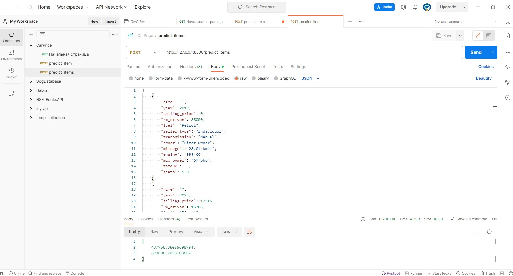

# Предсказание стоимости автомобиля.

Учебный проект по предсказанию стоимости автомобиля при помощи линейных моделей.

## Часть 1

- просмотрены основные статистики
- заполнены пропуски медианами
- удалены дубликаты
- убраны единицы измерения для признаков (mileage, engine, max_power). 
- столбцы (mileage, engine, max_power) приведены к типу float
- удалty столбец "torque"
- Построены и проанализированы графики зависимостей между признаками и между признаками и целевой переменной. Сделаны выводы.
- train и test совокупности выглядят похожими, с отличием в том, что у тренировочной выборки заметно больше выбросов
- Наименее скоррелированы между собой год и объем двигателя.
- Довольно сильная положитльная линейная зависимость между признакоми engine и max_power.

## Часть 2

- разделил данные на признаки и целевую переменную
- обучил классическую линейную регрессию с дефолтными параметрами
    - R2(test)=0.59
    - MSE(test)=233298800000
- стандартизировал признаки для train и отдельно для test
- обучил классическую линейную регрессию с дефолтными параметрами на стандартизированных признаках
    - результаты не изменились
- наиболее информативный в предсказании цены признак "max_power"
- проведены эксперементы с перебором параметров с помощью GridSearchCV на различных линейных моделей без категориальных пизнаков
    - результаты не улучшились

## Часть 3

- добавлены категориальные признаки при помощи OneHotEncoding
- при помощи GridSearchCV подобраны гиперпараметры и обучена модель Ridge
    - R2(test)=0.65
    - MSE(test)=2203804800000
    - гиперпараметр alpha принят равный 10

## Часть 5
    Реализован сервис на FastAPI

## Скриншоты работы сервиса

